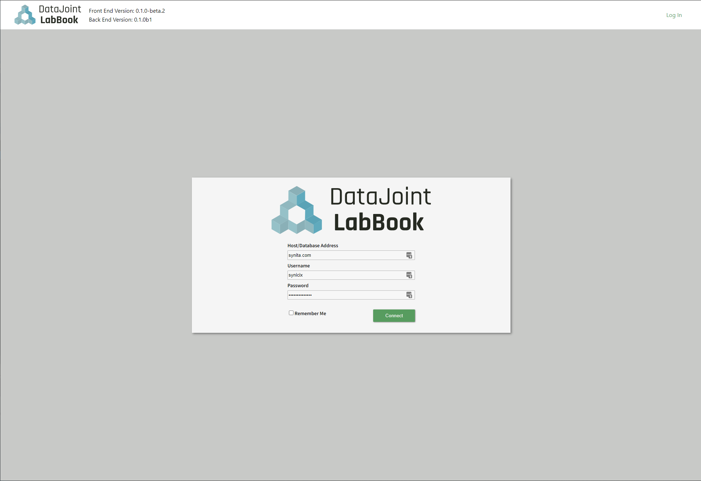
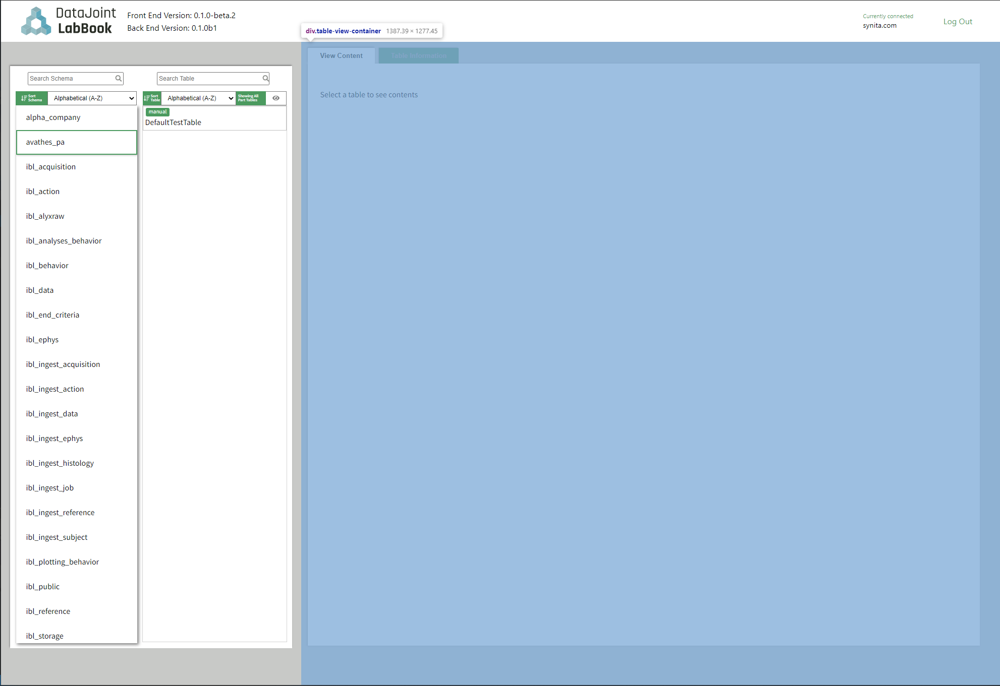
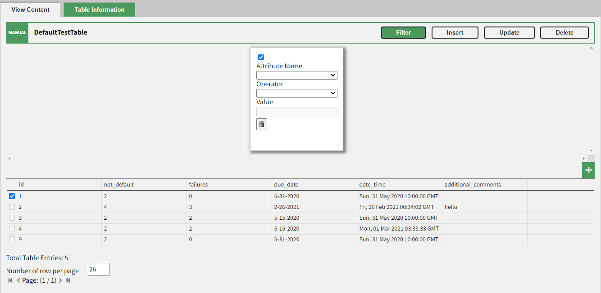
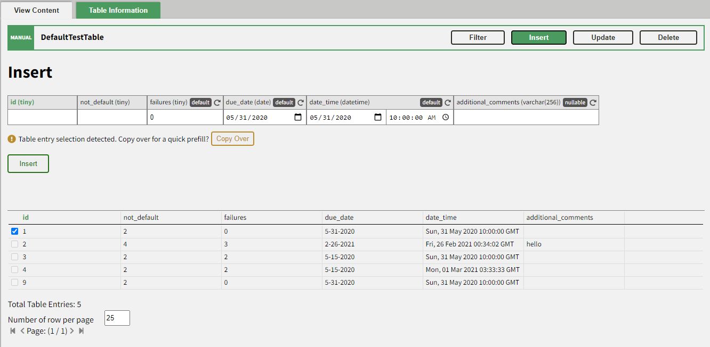

======
Design
======
 
This section is meant to give an overview of the design behind DataJoint LabBook for developers who are interested in contributing to the code base.
 
The code is built using ``react-cra`` using ``typescript`` with the backend being built on ``flask`` and ``datajoint``. Thus, it is highly recommended to get familiar with React's components and typical architecture design.
 
Architecture Overview
=====================
 
All of the major app's eact components are stored under ``./src/Components`` and are comprised of the following parts:
 
- :ref:`Login Component`
- :ref:`Navigation Bar Component`
- :ref:`Home Component` (Parent component to handle data passing between sub components)
    - :ref:`Side Menu Navigator Component`
    - :ref:`Table View Component`
 
Login Component
===============

 
The login component's only parent is ``App.tsx`` which is the parent component of the entire app.
 
At the moment, the login process and authentication is done in the following steps:
 
- User supplies the database, username, and password.
- Front end sends the information to the back end ``/api/login`` route to authenticate.
- If authentication was successful, then front end will receive a JWT token containing the credential information in the payload (NOTE: See `Pharus Docs <https://datajoint.github.io/pharus/pharus.html#pharus.server.login>`_ for more details on this).
- Subsequent API requests will use the JWT for authentication. The active JWT is stored at the ``App.tsx`` level.
 
Navigation Bar Component
========================
.. image:: _static/images/NavBarHighlight.png
 
The navigation bar handles getting the API versions for the frontend and backend along with displaying them. It also handles displaying the logo, login, and sign out.
 
Side Menu Navigator Component
=============================
.. image:: _static/images/SideMenuHighlight.png
 
The side menu navigator consists of two sub components: the schema and table list view.
 
It also stores a few buffer variables to keep track of what schema the user has selected so far and only reports back to the home component.
 
Schema List Component
---------------------
Schema List view is responsible for the following:
- Upon being loaded, fetch all available schema under the given database connection.
- Display all the schemas and restrict if the user types a non-empty string into the search box.
- Upon selection of a schema, use the callback to send the selected schema back to ``SideMenu`` component.
 
Table List Component
--------------------
Table List view is responsible for the following:
- After the user selected a schema, fetch all the tables and its type from the backend.
- Display all the tables and restrict if the user types a non-empty string into the search box.
- Upon the selection of a table, use the callback to send the table info back to the ``SideMenu`` component where it will send the info back to the ``Home`` component.
 
Table View Component
====================

 
Responsible for the handling of two sub components: the ``TableContent`` and ``TableInfo``. It also fetches the data required by both of them once this component receives a valid table name.
 
Table Content
-------------
.. image:: _static/images/TableContentHighlight.png

Table Content is mainly responsible for viewing, filtering, inserting, updating, and deleting records of a given table. It is divided into 5 components:
- Table Content View (Display the records of the table)
- Filter Component (Filter the records of the table)
- Insert Component (Insert a single record)
- Update Component (Update a single record))
- Deletion Component (Delete a single record at a time. Currently, the record must not have any child dependencies.)
 
Table Content View
~~~~~~~~~~~~~~~~~~

Table Content View is responsible for:
- Fetch and display a record
- Contain the ``Filter``, ``Insert``, ``Update``, and ``Delete`` components.
- Allow user to check a specific record to send one of the specific subcomponent (such as insert, update, and delete).
 
Filter Component
~~~~~~~~~~~~~~~~

Filter Component Notes:
- Allow the user to filter the records based on the available attributes (Currently, filtering by blob or longblob is not supported).
- Upon each change, all the restrictions (represented by filter cards) are checked to see if they are valid. If so, a fetch is performed with the new restrictions.
- There is a 1-second delay from the last change (such as typing) before the back end is queried and the view is updated.
 
Insert Component
~~~~~~~~~~~~~~~~

Insert Components Notes:
- Allow the users to insert a record using HTML inputs elements.
- If there is a checked record in the content viewer, it will ask the user if they want to copy over the record to the view.
 
Update Component
~~~~~~~~~~~~~~~~
.. image:: _static/images/UpdateComponentHighlight.png

Notes:
- User must select a record from the table content viewer which will be copy over to this component to perform the update.
- Only allows updates of non-primary and non-blob fields.
 
Delete Component
~~~~~~~~~~~~~~~~
.. image:: _static/images/DeleteComponentHighlight.png

Notes:
- User must select a record from a table content viewer which will be copied over to this component for deletion.
- Currently, ``Delete`` uses a quick delete operation (you may find more details on this in the ``datajoint`` pip package in ``datajoint.table.Table.delete_quick``). This means the record cannot have any child dependencies otherwise the delete will fail and return a message with additional details.
