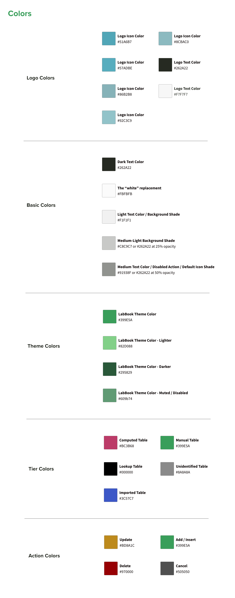
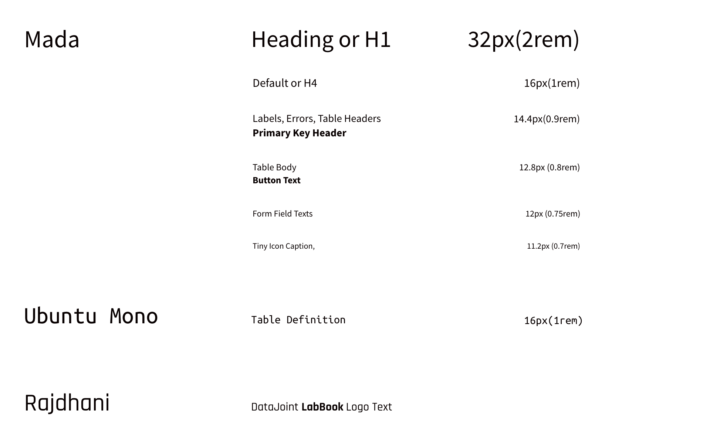
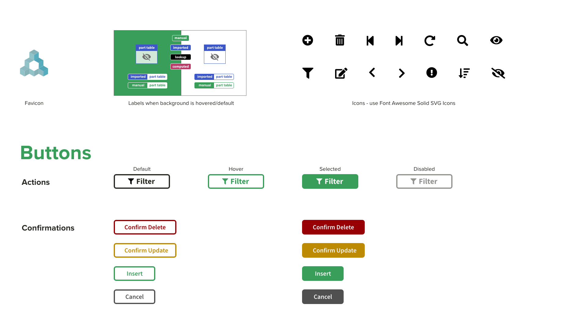

===========
Style Guide
===========
 
For those interested in contributing features with styling that is in alignment with the current LabBook look, this general style guide below may be used as a reference. 
 
Colors
======

View `PDF <_static/images/StyleGuideColors.pdf>`_ version for details.

Fonts
=====

View `PDF <_static/images/StyleGuideFonts.pdf>`_ version for details.

Logo
====
.. image:: _static/images/StyleGuideLogo.png
NOTE: For light colored background logo, make sure the place the logo on a background lighter than #8F8F8F. For a dark background logo, make sure to keep the background darker than #717171. When in doubt, check the `contrast accessibility <https://accessible-colors.com/>`_.
 
View `PDF <_static/images/StyleGuideLogo.pdf>`_ version for details.

Icons and Buttons
=================

View `PDF <_static/images/StyleGuideIcons.pdf>`_ version for details.
