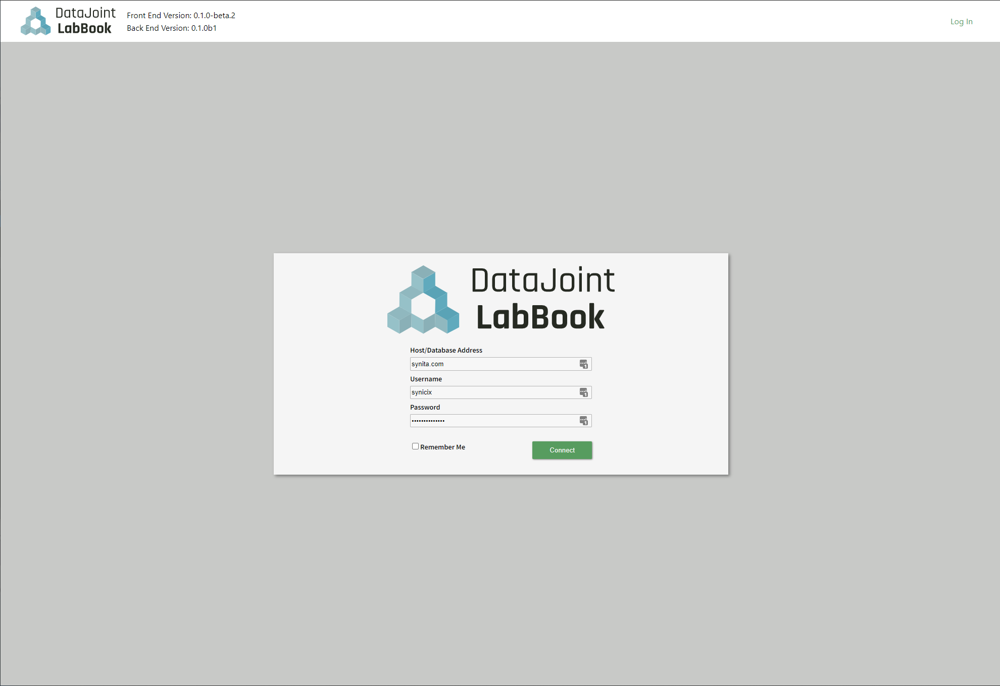
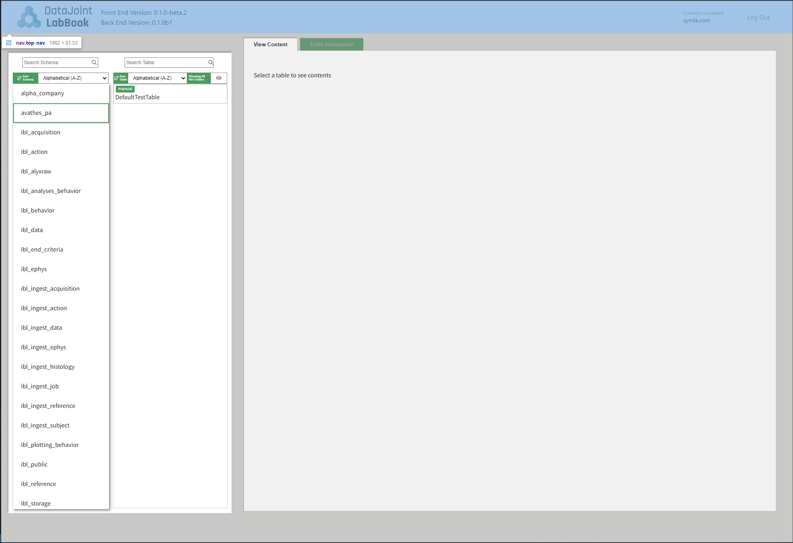
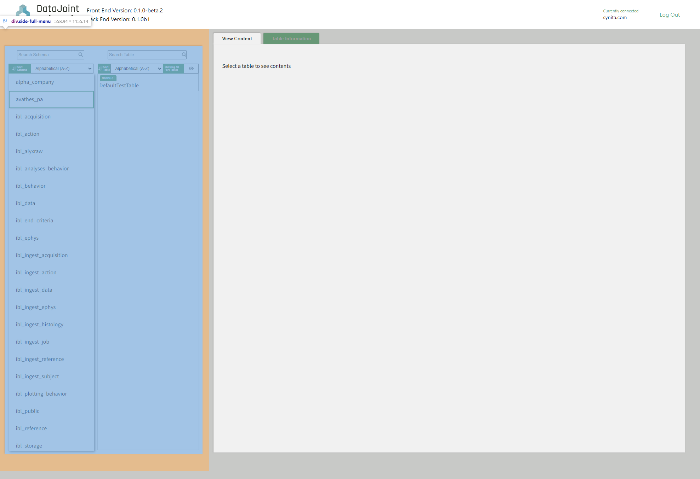
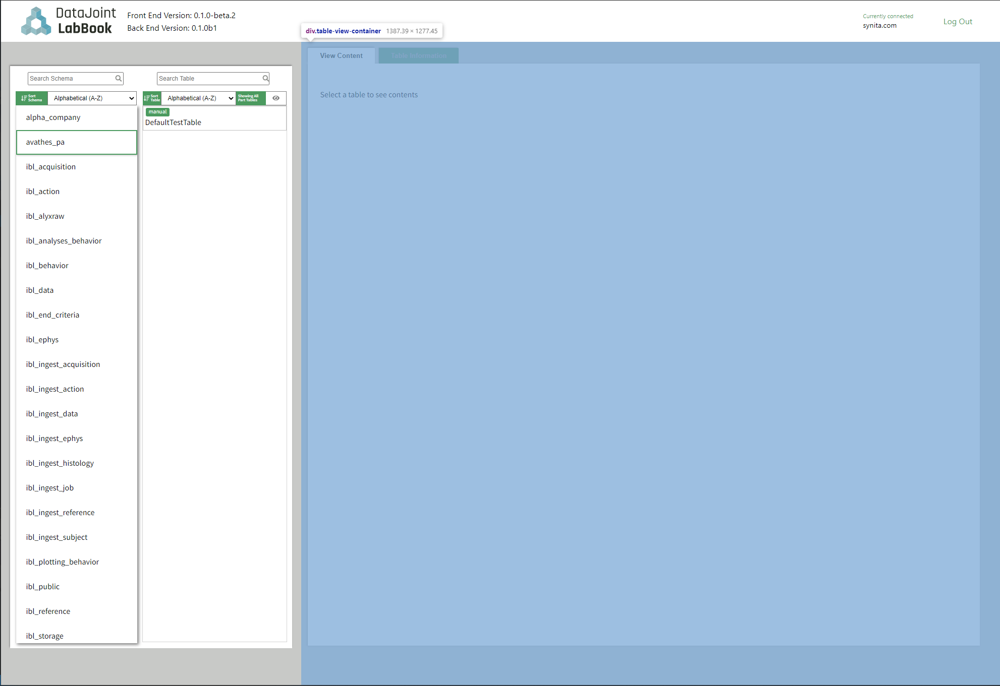
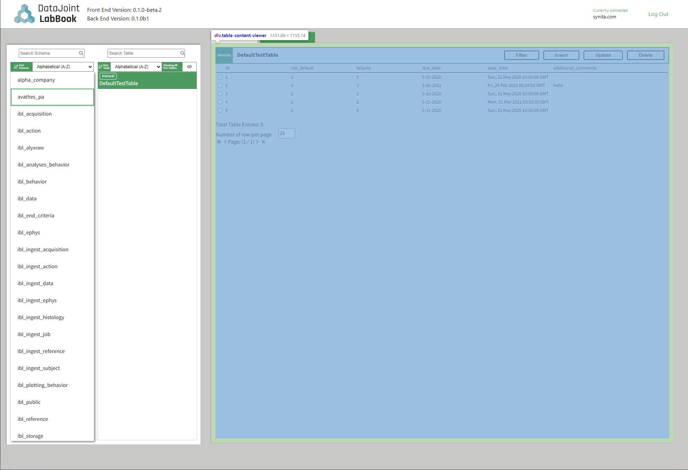
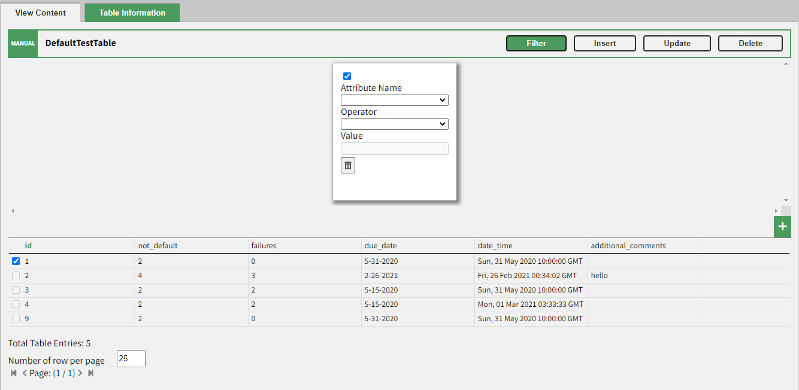
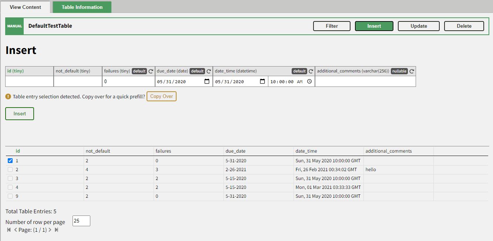
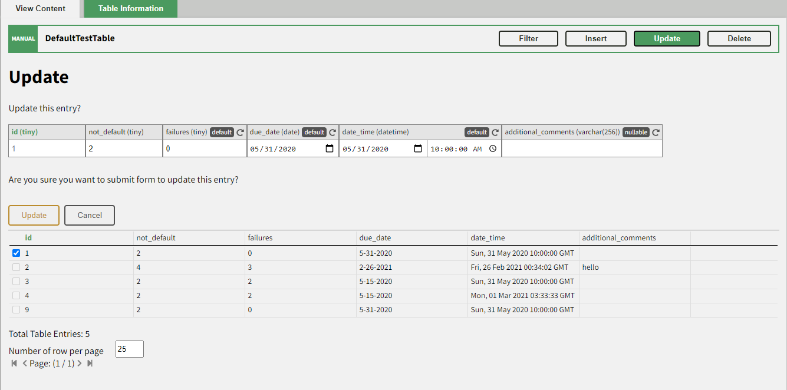
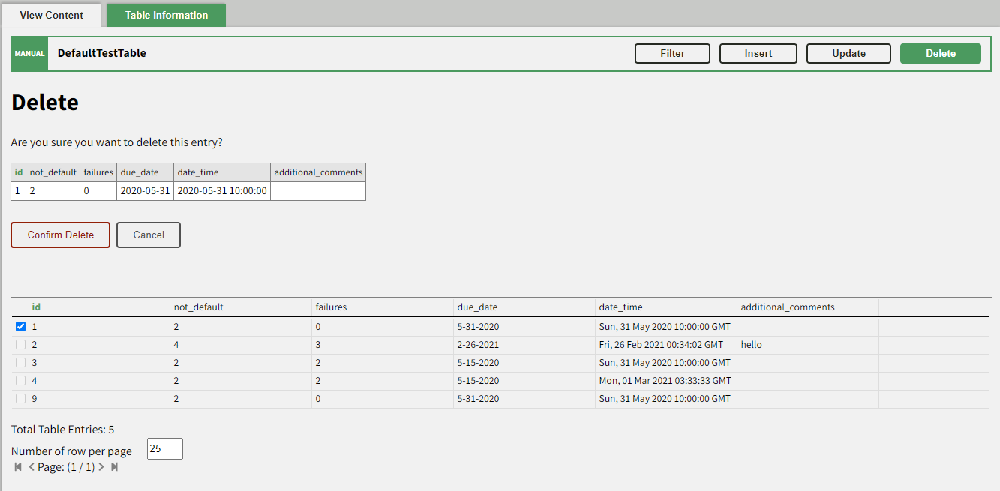

# DataJoint LabBook Developer Documentation

## Design Details

The code is built using `react-cra` using `typescript` with `flask` and
`DataJoint` as the primary backend components. Familiarity with React
components and typical architecture design will greatly benefit contributors.

## Architecture Details

All of the app's React components are stored under `./src/Components` and are
comprised of: 

+ Login Component
+ Navigation Bar Component
+ Home Component  

### Login Component

The login component’s only parent is `App.tsx` which is the parent component of
the entire app.

The login process and authentication performs the following steps:

+ A user supplies the database, username, and password.
+ The front end sends the information to the backend `/api/login` route to
  authenticate. If authentication is successful, the front end receives a
  JWT token containing the credential information in the payload.
+ Subsequent API requests will use the JWT for authentication. The active JWT is
  stored at the `App.tsx` level.



### Navigation Bar Component

The navigation bar handles getting the API versions for the frontend and backend
along with displaying them. It also handles displaying the logo, login, and sign
out.



### Side Menu Component

The side menu navigator consists of two sub components: the schema and table
list view.

This component stores buffer variables to track which schema has
is selected by the user so far and only reports back to the home component.



#### Schema List Component

Schema list view performs the following:

+ This view fetches all available schema for the database. 
+ Displays all the schemas and restricts entries if the user types a
  non-empty string into the search box. 
+ When a schema is selected, this view uses the callback to send the selected schema back to
SideMenu component.

#### Table List Component

Table list view performs the following:

+ Fetches all tables and its type from the backend database.
+ Displays all tables and restricts entries if the user types a non-empty string
  into the search box.
+ When a table is selected, this view uses the callback to send information
  about the selected table back to the `Side Manu` component which, in turn,
  sends the information back to the `Home` component.

### Table View Component

The table view component fetches data for a valid table in the database for two
sub-components: `TableContent` and `TableInfo`.



#### Table Content

Table content handles viewing, filtering, inserting, updating, and deleting
records from a table. It is divided into 5 components:

+ Table Content View: which displays the records of the table. 
+ Filter Component: which filters records of the table according to a
  user-defined entry.
+ Insert Component: which inserts single new record into the table.
+ Update Component: which updates a single record in the table. 
+ Deletion Component: which deletes a single record at a time, if the record
  does not have any child dependencies. 



#### Table Content View

The table content view is responsible for fetching and diplaying records in a
table. This view allows the user to check a specific record and send it to one
of its four subcomponents - `Filter`, `Insert`, `Update`, and `Delete`.

#### Filter Component

The Filter component allows users to filter records based on the attributes of a
table. The user is able to assign operators to customize the filter which, in
turn, fetches data from the backend with the appropriate restrictions. The
user-defined restrictions are represented by filter cards and are first checked
for validity before the fetch is performed. There is a 1-second delay from the
change in the filter to querying the backend and updating the view. 



#### Insert Component

The Insert component allows users to insert a record using HTML input elements.
If there is a checked record in the content viewer, the user will be prompted
about copying the record to the view. 



#### Update Component

A user can select a record from the table content viewer which gets copied to
this component, allowing the user to update non-primary and non-blob fields. 



#### Delete Component

A user can select a record from the table content viewer which gets copied to
this component for deletion. Currently, `delete` uses a quick delete operation
which will raise an error if the record contains child dependencies. 



## General Notes

### Working with Source

#### Run Locally with Docker

+ Copy a `*-docker-compose.yaml` file corresponding to your usage to
  `docker-compose.yaml`. This file is untracked, and thus, can be modified as
  necessary. General commits can be made to `docker-compose.yaml` but system-
  and setup-dependent items should remain on your local version. 

+ The first comment provides instructions on how to start the service. Any
  keyword arguments prepended to the `docker-compose` command can be safely
  moved to a dedicated `.env` and read automatically if they are not evaluated
  i.e. `$(...)`. Non-evaluated environment variables include the following:

```console
PY_VER=3.8    # (pharus) Python version: 3.6|3.7|3.8
IMAGE=djtest  # (pharus) Image type:     djbase|djtest|djlab|djlabhub
DISTRO=alpine # (pharus) Distribution:   alpine|debian
```

#### Run Tests with Docker

To run the test watcher, follow the steps below:

+ In one terminal, start the `dev` Docker environment using the instructions
  above to start LabBook and Pharus with hot-reload support. 

+ In another terminal, you can run the watcher using: 

```console
docker exec -it datajoint-labbook_datajoint-labbook_1 npm test -- --coverage
# OR to just run it once:
docker exec -ite CI=true datajoint-labbook_datajoint-labbook_1 npm test -- --coverage
```

#### Working with git submodule dependency

`pharus` is treated as a backend dependency managed by git's builtin
`submodules`. It allows nesting entire git repositories with separate histories and
easy access. The commands below should be used after cloning the source
repository: 

+ First time git submodule initialization: `git submodule init` then `git
  submodule update`.

+ Update submodules to latest version: `git submodule foreach git pull`

+ Create a new submodule: `git submodule add -b master git@github.com:datajoint/pharus.git`