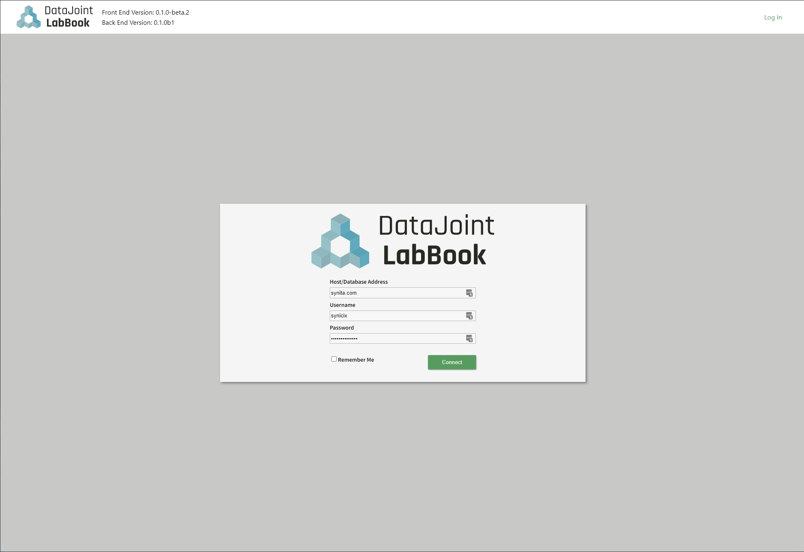

# DataJoint LabBook

DataJoint LabBook is a graphical user interface (GUI) designed to simplify
interacting with DataJoint workflows. DataJoint LabBook eliminates the need to
use code to enter data into the mySQL relational database tables that are the
foundation of DataJoint workflows. 

Please see the [user documentation](./userDocumentation.md) to launch your own
local version of DataJoint LabBook. To learn about the underlying architecture
or to contribute to the project, please refer to the [developer
documentation](./developerDocumentation.md) and [style guide](./style.md) for
detailed explanations of the backend architecture and design principles
underlying DataJoint LabBook. 

