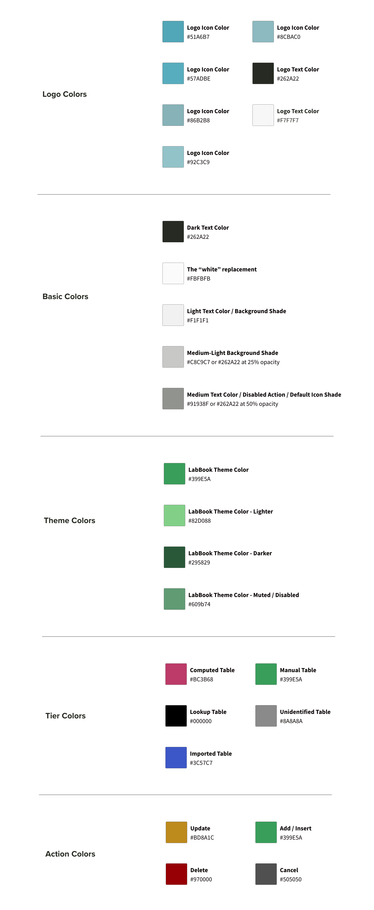
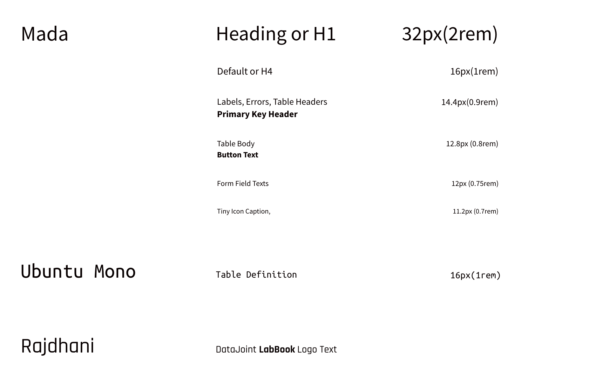
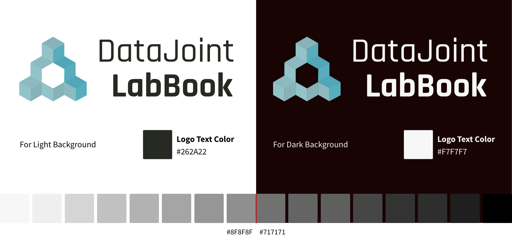
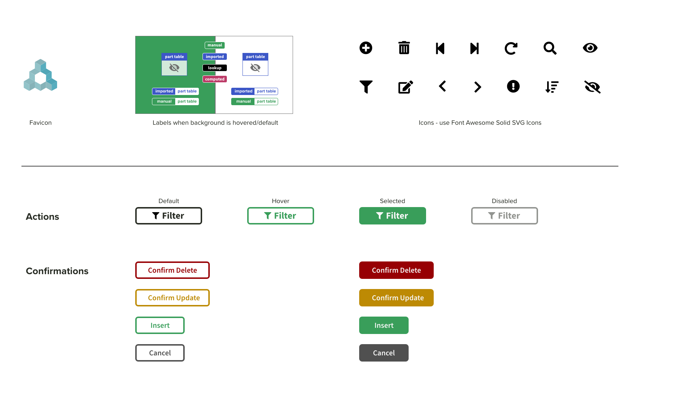

# DataJoint LabBook Style Guide

The general style guide below provides a reference for contributors
adding features that adhere to the current DataJoint LabBook style. 

## Colors

View the
[PDF](https://datajoint.github.io/datajoint-labbook/_static/images/StyleGuideColors.pdf)
version for details.

## Fonts

View the
[PDF](https://datajoint.github.io/datajoint-labbook/_static/images/StyleGuideFonts.pdf)
version for details.

## Logo

The logo with the light background must be placed on a background lighter than
`#8F8F8F`. The logo with the dark background must be placed on a background
darker than `#717171`. If in doubt, check the [contrast accessibility](https://accessible-colors.com/).

View the
[PDF](https://datajoint.github.io/datajoint-labbook/_static/images/StyleGuideLogo.pdf)
version for details.

## Icons and Buttons 

View the
[PDF](https://datajoint.github.io/datajoint-labbook/_static/images/StyleGuideIcons.pdf)
version for details.